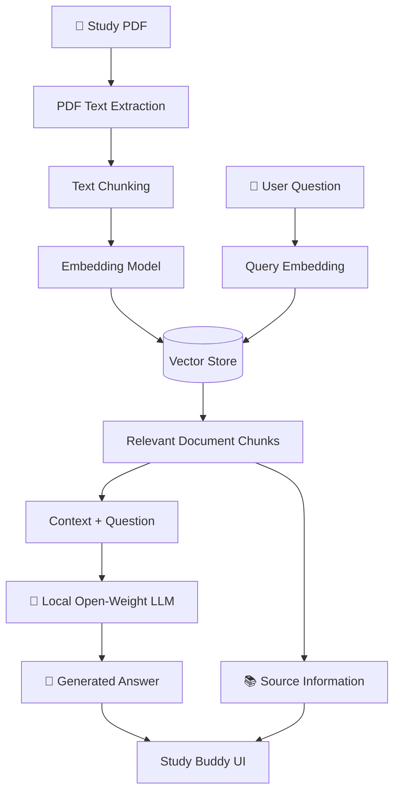

# 📚 Study Buddy

> **A local AI-powered study assistant that helps students understand their study materials using open-weight AI and Retrieval-Augmented Generation (RAG).**

[](https://www.python.org/)
[](https://fastapi.tiangolo.com/)
[](https://ollama.com/)
[](#how-rag-works)
[](LICENSE)

---

## 📌 About the Project

**Study Buddy** is a local AI study assistant designed to help students learn from their own study materials.

Instead of asking an AI model to answer questions using only its general knowledge, Study Buddy allows students to upload their study materials, such as PDF notes, and ask questions about them.

The application uses **Retrieval-Augmented Generation (RAG)** to retrieve relevant information from the uploaded documents and provide that information to a local **open-weight language model** before generating an answer.

### Example

A student uploads:

```text
Operating Systems Notes.pdf
DBMS Notes.pdf
DSA Notes.pdf
```

Then asks:

> "What are the four necessary conditions for deadlock?"

Study Buddy searches the uploaded material, retrieves the relevant section, and gives the retrieved context to the local AI model to generate the answer.

---

# 🎯 Problem

Students often have their study material spread across multiple PDFs and documents.

Finding a specific concept can require manually searching through large documents.

Study Buddy aims to make this easier by allowing students to:

- Upload their study material
- Ask questions in natural language
- Find relevant information automatically
- Get AI-generated explanations based on their own material
- Keep their documents and AI processing local

---

# ✨ Features

- 📄 **PDF Upload** — Upload study materials in PDF format.
- 📝 **Text Extraction** — Extract text from uploaded documents.
- ✂️ **Text Chunking** — Split documents into smaller searchable sections.
- 🧠 **Embeddings** — Convert text into numerical representations.
- 🔎 **Semantic Search** — Find relevant sections based on meaning rather than exact keywords.
- 📚 **RAG** — Retrieve relevant study material before generating an answer.
- 🤖 **Local LLM** — Use an open-weight language model locally through Ollama.
- 🔐 **Privacy** — Study materials can remain on the user's machine instead of being sent to a third-party AI provider.
- 🔗 **Source Information** — Return information about the documents used to answer a question.
- ⚡ **FastAPI Backend** — REST API for document processing and question answering.
- 🖥️ **Simple UI** — Upload documents and ask questions through a simple interface.

---

# 🧠 How It Works

The complete pipeline looks like this:



---

# 🔍 How RAG Works

Study Buddy uses **Retrieval-Augmented Generation (RAG)**.

Instead of:

```text
User Question
      ↓
     LLM
      ↓
   Answer
```

Study Buddy uses:

```text
User Question
      ↓
Create Query Embedding
      ↓
Search Vector Store
      ↓
Retrieve Relevant Chunks
      ↓
Send Context + Question to LLM
      ↓
Generate Answer
```

### Why RAG?

A general-purpose LLM may not know the contents of a student's personal notes.

RAG allows Study Buddy to retrieve relevant information from the user's own documents before generating the response.

This makes the response more relevant to the student's material.

---

# 🧩 Core Concepts

## 1. LLM

**LLM = Large Language Model**

The language model is responsible for generating the final response.

Study Buddy uses a locally running open-weight model instead of depending entirely on a closed cloud AI API.

---

## 2. Open-Weight Model

An open-weight model makes its trained model weights available for users to download and run, subject to the model's license.

This allows Study Buddy to run AI inference locally.

---

## 3. Embeddings

Embeddings convert text into numerical vectors that represent semantic information.

For example:

```text
"What is deadlock?"
        ↓
Embedding Model
        ↓
[0.12, -0.42, 0.73, ...]
```

This allows Study Buddy to search for text that is **semantically similar** to a question.

---

## 4. Vector Store

Document embeddings are stored locally in a vector store.

When the user asks a question, the question is converted into an embedding and compared with stored document embeddings.

The most relevant chunks are retrieved.

---

## 5. Local Inference

The LLM runs locally instead of requiring every question to be sent to an external AI service.

The basic flow is:

```text
Study Buddy
     ↓
Ollama
     ↓
Local Open-Weight Model
     ↓
Response
```

---

# 🛠️ Tech Stack

### Backend

[](https://www.python.org/)
[](https://fastapi.tiangolo.com/)

- **Python** — Main programming language
- **FastAPI** — Backend API framework

### AI / ML

[](https://ollama.com/)
[](https://huggingface.co/)

- **Open-weight LLM** — Generates responses
- **Ollama** — Runs the LLM locally
- **Embedding Model** — Converts text into vectors
- **RAG** — Retrieves relevant context before generation

### Document Processing

- PDF text extraction
- Text chunking
- Document metadata handling

### Storage

- Local vector store
- Local document storage

---

# 🏗️ Project Structure

```text
study-buddy/
│
├── app/
│   ├── main.py
│   │
│   ├── routes/
│   │   ├── documents.py
│   │   └── chat.py
│   │
│   ├── services/
│   │   ├── llm.py
│   │   ├── embeddings.py
│   │   └── rag.py
│   │
│   └── utils/
│       └── pdf_loader.py
│
├── documents/
│   └── .gitkeep
│
├── data/
│   └── .gitkeep
│
├── tests/
│
├── requirements.txt
├── .env.example
├── .gitignore
├── README.md
└── LICENSE
```

---

# 🔄 Application Flow

### Document Upload

```text
User
 ↓
Upload PDF
 ↓
FastAPI
 ↓
PDF Text Extraction
 ↓
Text Chunking
 ↓
Embedding Model
 ↓
Vector Store
```

### Question Answering

```text
User Question
 ↓
FastAPI
 ↓
Query Embedding
 ↓
Vector Search
 ↓
Relevant Chunks
 ↓
Local LLM
 ↓
Answer + Sources
 ↓
User
```

---

# 🚀 Getting Started

## Prerequisites

Make sure you have:

- Python 3.10+
- Git
- Ollama
- An open-weight model supported by your local setup

---

## 1. Clone the Repository

```bash
git clone https://github.com/YOUR_USERNAME/study-buddy.git

cd study-buddy
```

Replace `YOUR_USERNAME` with your GitHub username.

---

## 2. Create a Virtual Environment

### Linux / macOS

```bash
python3 -m venv .venv
source .venv/bin/activate
```

### Windows

```powershell
python -m venv .venv
.venv\Scripts\activate
```

---

## 3. Install Dependencies

```bash
pip install -r requirements.txt
```

---

## 4. Install and Run Ollama

Install Ollama from:

https://ollama.com/

Then download an appropriate open-weight model:

```bash
ollama pull <MODEL_NAME>
```

Run Ollama:

```bash
ollama serve
```

The exact model depends on your available RAM/VRAM and the model selected for the project.

---

# ▶️ Running the Application

Start the FastAPI server:

```bash
uvicorn app.main:app --reload
```

The API will be available at:

```text
http://127.0.0.1:8000
```

FastAPI's interactive API documentation is available at:

```text
http://127.0.0.1:8000/docs
```

---

# 📄 Uploading Study Material

Upload a PDF through the document upload endpoint.

Example:

```http
POST /documents
```

The application will:

```text
PDF
 ↓
Extract text
 ↓
Split into chunks
 ↓
Generate embeddings
 ↓
Store embeddings
```

---

# 💬 Asking Questions

Use:

```http
POST /chat
```

Example request:

```json
{
  "question": "Explain deadlock in simple terms."
}
```

Example response:

```json
{
  "answer": "Deadlock occurs when...",
  "sources": [
    {
      "document": "os_notes.pdf"
    }
  ]
}
```

---

# 🔐 Why Local & Open AI?

One of the main goals of this project is to explore how **open AI technologies can provide practical advantages over closed AI services**.

### Privacy

Study materials may contain personal notes or academic information.

With local inference:

```text
User Documents
      ↓
Local Application
      ↓
Local Model
```

The documents don't need to be uploaded to a third-party AI service.

### Model Flexibility

Because the system uses an open-weight model, the model can potentially be replaced with another compatible model.

```text
Study Buddy
     ↓
Model A

or

Study Buddy
     ↓
Model B
```

### Cost

Local inference does not require paying for an API call for every question, although running models locally still consumes computer resources such as CPU, RAM, and potentially GPU resources.

### Customization

Open models provide more flexibility for experimentation, model selection, and future customization.

---

# 🎯 Hacktoberfest 2026

Study Buddy was created as part of **Hacktoberfest 2026's "Build for a Friend" challenge**.

The goal of the challenge is to build something using open-source AI that solves a real problem for a friend or someone you care about.

### The Problem

Students often have large amounts of study material but struggle to quickly find and understand specific information.

### The Solution

Study Buddy allows a student to upload their study material and ask questions about it.

### Why Open Innovation?

The project uses open-weight/local AI so that:

- Study material can remain local.
- The model can be changed or experimented with.
- The project does not depend entirely on a closed AI API.
- The application can work without sending study documents to an external AI provider.

---

# 🧪 Example Use Cases

### 📚 Exam Preparation

> "Explain normalization in DBMS."

### 🧠 Concept Understanding

> "Explain deadlock like I'm a beginner."

### 🔎 Finding Information

> "What are the conditions required for deadlock?"

### 📝 Revision

> "Give me the important topics from this chapter."

---

# 🚧 Current Limitations

This project is currently an MVP.

Possible future improvements include:

- Multiple document collections
- Conversation history
- Better source/page tracking
- Streaming responses
- User accounts
- Quiz generation
- Flashcard generation
- Voice interaction
- Better document formats
- Improved retrieval techniques
- Model selection from the UI
- More advanced evaluation of RAG responses

---

# 🔮 Future Improvements

```text
Current
  ↓
PDF → RAG → Local LLM
  ↓
Future
  ├── Quiz Mode
  ├── Flashcards
  ├── Study Planner
  ├── Conversation Memory
  ├── Voice Input
  └── Multiple Subject Libraries
```

---

# 🤝 Contributing

Contributions are welcome!

If you'd like to contribute:

```bash
# Fork the repository

# Clone your fork
git clone <your-fork-url>

# Create a branch
git checkout -b feature/my-feature

# Make your changes

# Commit
git commit -m "Add my feature"

# Push
git push origin feature/my-feature
```

Then open a discussion or contribution according to the project's contribution guidelines.

---

# 📜 License

This project is licensed under the **MIT License**.

See the [LICENSE](LICENSE) file for details.

> Note: The MIT License applies to the project's source code. Third-party libraries, models, and other components may have their own licenses and terms.

---

# 👨‍💻 Author

Prabodh Kumar

Built with ❤️ for learning, experimentation, and Hacktoberfest 2026.

---

## ⭐ If You Find This Project Useful

Give the repository a ⭐ on GitHub and feel free to experiment with the project.

---
